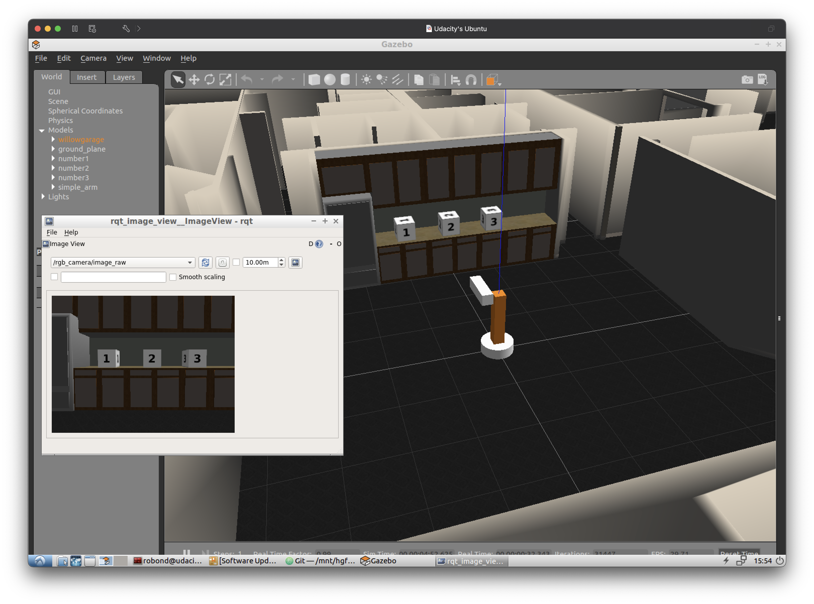

# Simple_Arm
[](https://opensource.org/licenses/MIT) [](https://svgshare.com/i/Zhy.svg) [](https://atom.io)  

Simple arm mini-project from Udacity's Robotics Software Engineer Nanodegree. This mini-project uses [Simple Arm](https://github.com/udacity/RoboND-simple_arm/tree/first_interaction) repository as a base.  

<p align="center"></p>

## Environment
👉 Ubuntu 16.04 LTS  
👉 [ROS Kinetic Kame](http://wiki.ros.org/kinetic)  
👉 C++ 11   

## Compiling and Running
### Compiling
First, make sure you have sourced your ROS distro into the terminal environment  
```
source /opt/ros/kinetic/setup.bash
```

Then, create a catkin workspace (skip this step if you already have one)  
```
mkdir -p /home/workspace/catkin_ws/src/
cd /home/workspace/catkin_ws/src/
catkin_init_workspace
```

Clone this repository inside the `src` folder  
```
git clone https://github.com/MichelleMouse/Simple_Arm.git simple_arm
```

Build the package and source the `.bash` setup into the environment  
```
cd ..
catkin_make
source devel/setup.bash
```

### Running
Make sure to check and install all dependencies in the package  
```
rosdep install -i simple_arm
```

Launch the simulation environment  
```
roslaunch simple_arm robot_spawn.launch
```

To see the camera feedback, open a new terminal and run the following commands   
```
source /opt/ros/kinetic/setup.bash
cd /home/workspace/catkin_ws/
source devel/setup.bash
rosrun image_view image_view image:=/rgb_camera/image_raw
```

Then, to interact with the safe_move service, run the following commands in a new terminal window  
```
source /opt/ros/kinetic/setup.bash
cd /home/workspace/catkin_ws/
source devel/setup.bash
rosservice call /arm_mover/safe_move "joint_1: 1.57
joint_2: 1.57"
```

Don't forget the line break between `joint_1` and `joint_2` command.
